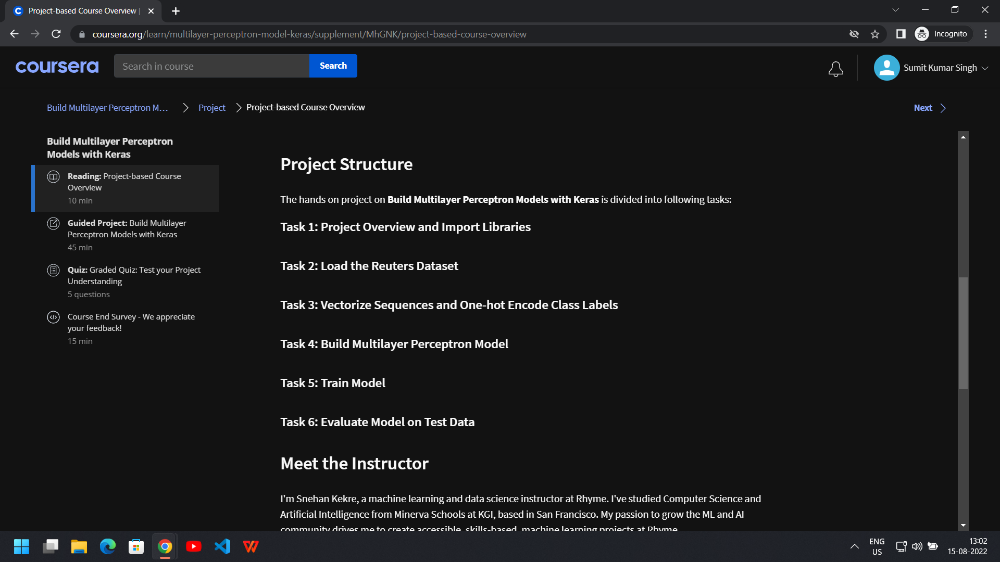

# Build Multilayer Perceptron Models with Keras

This beginner level practice project explores basic functionality of keras library for creating a simple perceptron, we also learn what is one-hot encoding and use early stopping callback feature for early stopping of training when desired metric is achieved.

One hot encoding is a process by which categorical variables are converted into a form that could be provided to ML algorithms to do a better job in prediction.

Example of One-Hot Encoding:

We will update number of layers in our perceptron and run our model again.

