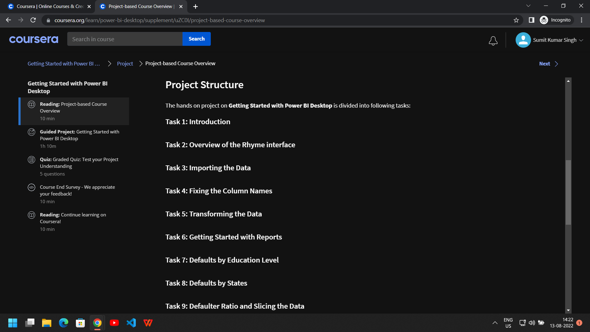
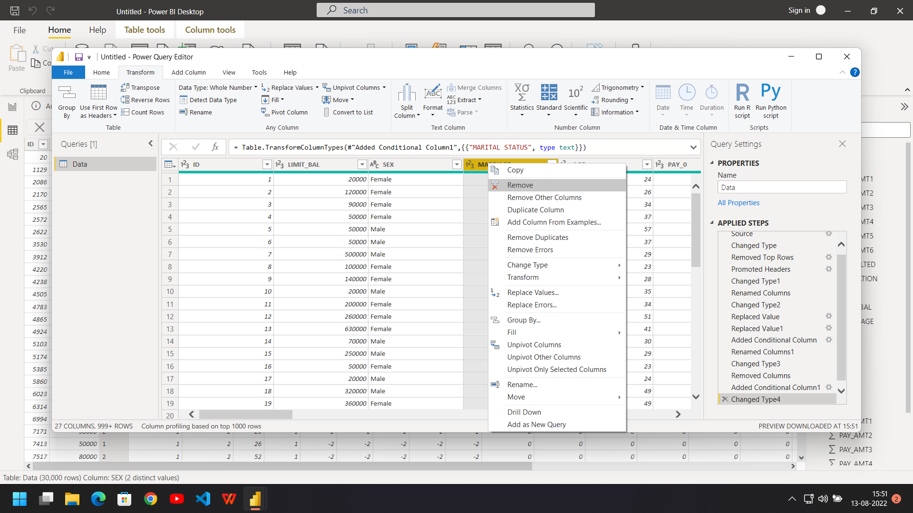
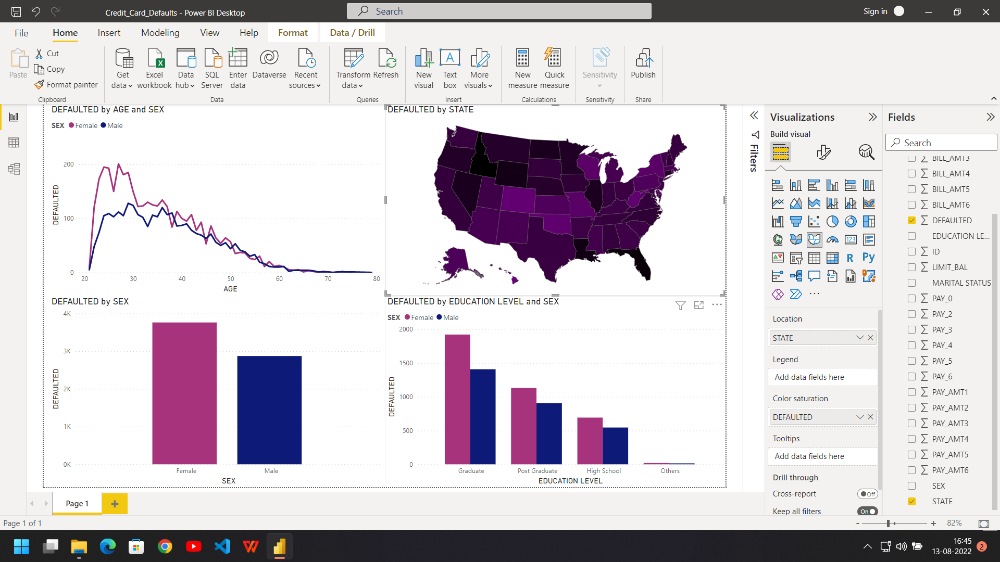
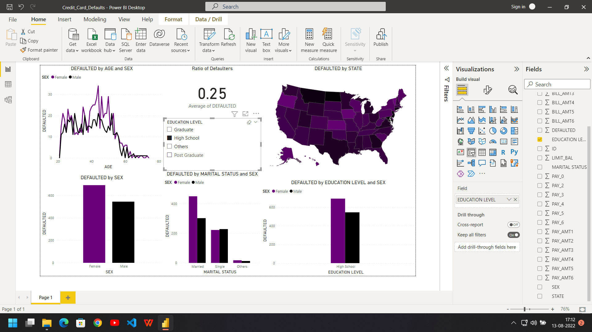

# Getting Started with Power BI Desktop

## Final Report

## Project Structure

### Steps

Open Power BI Desktop

Import data from excel file

Load or Transform

Loading

See Fields Pane on the right hand side of the screenshot

Raw Data Overview

Click Transform Data under Home Tab

Opens Power Query Editor

Current columns names are not descriptive of the data, set row 2 as column names to make the table more descriptive

To remove row 1 click on Remove Rows

Select Remove Top Rows and enter 1 and click Ok

Row 2 becomes row 1

Set first row as headers

Now the data looks more descriptive

Change the names of columns so all column names are proper

Click Close and Apply under Home Tab in Power Query Editor

See the transformations

Select column SEX

Change Data Type from Whole Number to Text

Open Power Query Editor

Select column SEX and see the option to change data type in Power Query Editor

Click on Replace Values

In Replace Values dialog box chose and replace values

Column SEX now contains categorical text values "Male" and "Female"

Select column EDUCATION and click on Conditional Column

Add Conditional Column dialog box opens

Add Conditions as shown and click Ok

A new column appears with subsituted values

Change data type from any to text

Remove Old Column

Do same for column MARRIAGE

Click close and apply

Select Report Canvas on left hand side of the screenshot

This is the window were Charts and Graphs are created

Select DEFAULTED on y-axis

Select AGE on x-axis, Power BI creates a chart for us

You can resize it or open it or click on Focus Mode to focus on any particular chart/graph

Select Line Chart from Visualizations Pane

Drag and Drop SEX to Legend in Visualizations Pane

This creates new line chart with multiple values for y-axis

Add another chart from Visualizations by clicking outside canvas and dragging and dropping columns from Fields Pane to Visualizations Pane, select bar chart

Add column SEX to legends

Add another bar chart as shown

Change colours of charts from visual tab under Visualizations Pane

Go back to build visual tab under Visualizations Pane to create another chart

Notice you can interact with this incomplete chart by clicking various elements for example select line for male values in line chart and see how other charts change

Add another chart

Select field map from Visualizations Pane to get a real time Bing Map

You can zoom in and out of the map and add columns like SEX to see how it changes

We need to change some settings to use preview features

Changes to settings require restart, we need to save current report

Reopen the saved report

Select new shape map under Visualizations Pane

Remove SEX from legend, saturation is set to DEFAULTED

Change colours to match

This report is interactive and we can select different elements

Add another chart and change colours to match colour of the report

Select and add card from Visualizations Pane

Right now it shows total number of defaulters

Right click selected field and select average to change to ratio

We select different elements to see how our report changes

Add slicer from Visualizations Pane and interact with it

### Quiz

