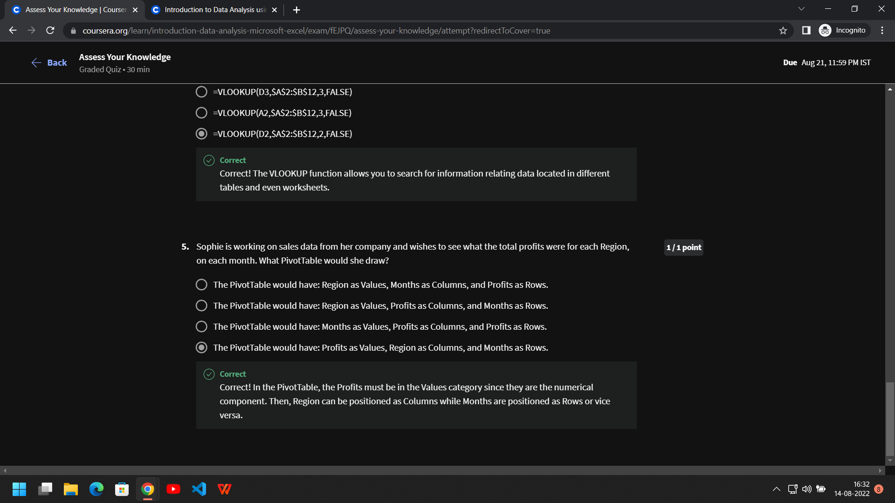

# Introduction to Data Analysis using Microsoft Excel
## Project Structure

### Steps
Upload and open data in Excel using Office 365, the first worksheet of this workbook shows information about Office Chair Sales

Select a cell and press Ctrl+A to select all the cells containing tabular data

After selecting all the cells, go to insert tab menu and select table beside pivot table option

This opens a dialog box, tick the option to select first row as header and click Ok

A new "visually easy on eye" table in blue and white is created for us scroll down and notice how headers stay up there for reference.

Notice that each column name has a drop down arrow

Click on the drop down arrow for column Sales Rep and select sort A to Z to sort in ascending order

The column along with all data in other columns is sorted in alphabetically ascending order

We can go back to original view by sorting ID column in ascending order

Click on drop down arrow on column Region and notice how we have check boxes for each data entry for the column, we can use this to filter data, select North region and deselect others

The data for North region is shown

Select first cell under Total column and press Ctrl+down-arrow to select all data in that column

Notice when a column is selected we get summary about that column in a ribbon just above task bar, this ribbon shows Count, Average and Sum

Let's use the fact above to see some aggregations for a particular Sales Rep, under drop down menu in Sales Rep column select Sarah Davis and then repeat above step

We get Average, Count and Sum for Sarah Davis

Go back to origin view by removing filter

Now we are going to add a new column called "Discount", this will indicate whether the particular sale is eligible for discount or not

Use if function as shown to auto populate whole column instead of filling for each row

Add another column "Final Price" to calculate price of sale after applying discount or othrewise show the original price

Use the if function as before with some modifications as shown to auto populate each row with the appropriate price

Change the data type to Accounting to get Dollar Sign before each price

Use Decrease Decimal option in number section of menu to format data and remove zeros after decimal point

This is the second sheet called Customer Info, this table shows relationship between Customer, Company Name and Sales Rep

Go back to previous sheet and select column G just after Customer ID and right click to open a menu and select insert column named "Company Name", now we are going to relate two sheets using VLOOKUP function to auto populate this new column

Add formulae as shown below to auto populate the column

Add another column called "Representative" just beside it as before

Add another VLOOKUP formulae to relate columns and auto populate new column

Select all table as before by pressing Ctrl+A, now we are going to create a pivot table to perform some data analysis

Under inset tab in menu select pivot table

Click Ok

A new pivot table is created for us with a menu as you can see on the right side of the screenshot for us to drag and drop fields to create a table for analysis

Put columns that contain numbers under Summation Values box like below we have Final Price and put columns that are dependent on above columns in Rows box like Sales Rep here to create a column as shown below

You can move Sales Rep to Columns box to transpose the data

Let's check out monthly sales by each Sales Rep

Monthly Sales of each  model in dollars

Monthly Sales of each model in numbers of chairs

We can also combine the above two as shown below

### Quiz

